# LittleSunInputMethod

## 简介
该系统软件为个人自主开发的可运行在uos操作系统和linux操作系统的一款可同时支持拼音输入和手写输入的软键盘输入法

本输入法集成拼音检索算法和手写识别算法和软键盘为一体，可提供字符输入、拼音输入、手写输入和符号输入等功能， 此外还提供主题切换、键盘大小调节、 应用自启、应用自动退出、键盘自动显示和隐藏等功能

## 开发环境

qt版本: 5.11

输入法框架: fcitx4

与插件交互方式: dbus服务

插件地址: https://github.com/dshadow0943/fcitx-littlesun

为增加系统易移植性，此系统开发为两部分，分别为与用户交互的客户端界面和输入法插件，客户端软件部分与系统不进行任何的直接交互，所有交互都通过插件间接交互。

## 主要功能

拼音中文汉字输入、

手写中文汉字输入、

手写数字输入、

手写字母输入、

数字输入、

字母输入、

符号输入、

联想输入、

键盘移动、

键盘大小适应及调节、

应用自启、

应用自动退出、

键盘自动显示和隐藏等

可通过插件可在用户聚焦时自动启动客户端软件、用户输入时可自动向用户聚焦的目标位置输出字符以及删除字符、关闭后为直接终止客户端软件运行，不会在后台驻留，节省系统内存空间。

## 安装及使用

### 安装包下载

   客户端: https://github.com/dshadow0943/LittleSunInputMethod/releases/tag/v2.0.1

   插件: https://github.com/dshadow0943/fcitx-littlesun/releases/tag/v1.2.1

### 安装

1. 可自行下载deb安装自行安装

    dpkg命令： sudo dpkg -i fcitx-littlesun-2.0.1-linux.deb
   
    其中 fcitx-littlesun-1.2.1-linux.deb 为安装包名
    
2. 源码编译安装

注： 该软件分为客户端软件和插件两部分，只有两个软件包都安装后且系统默认输入框加为fcitx小企鹅输入法框架才可正常使用，安装顺序无要求，
其中客户端安装包命名为littlesun, 插件命名为fcitx-littlesun

插件地址: https://github.com/dshadow0943/fcitx-littlesun

## 部分界面图

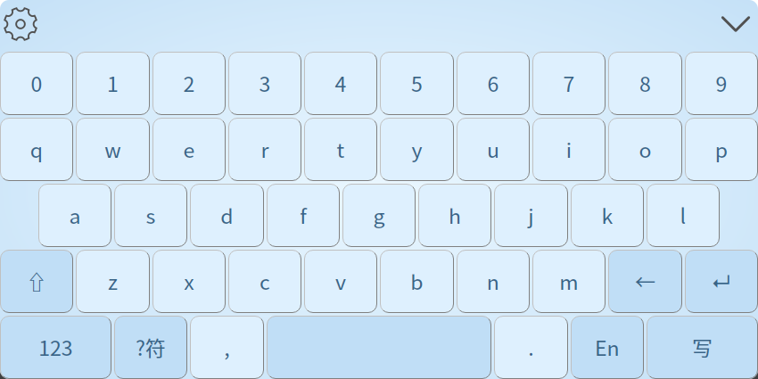

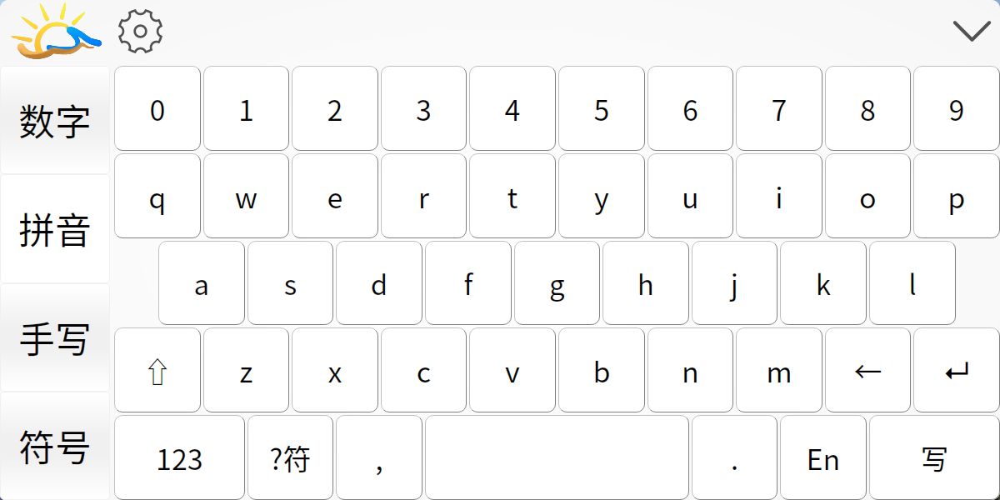

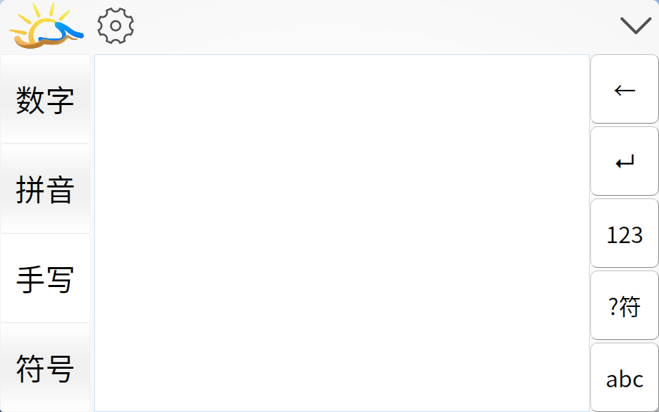

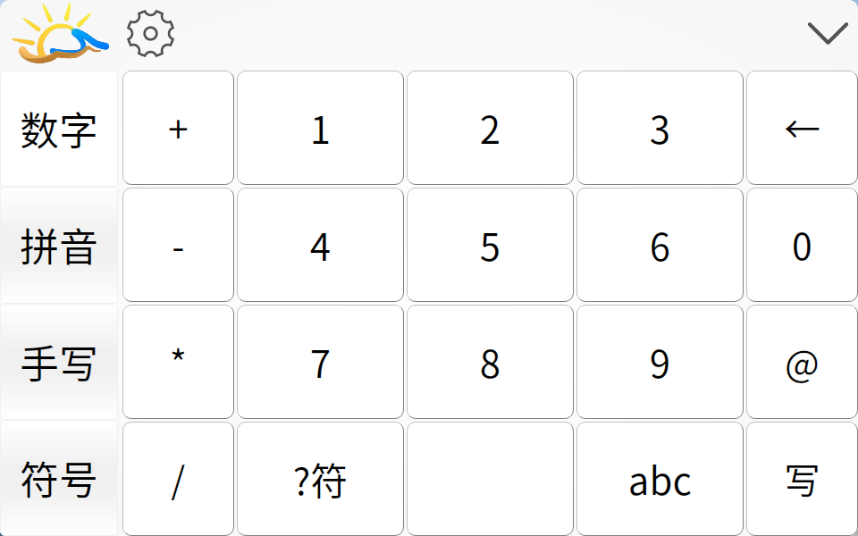

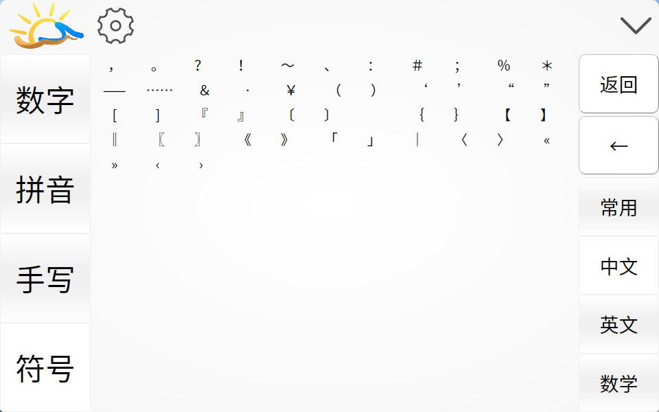

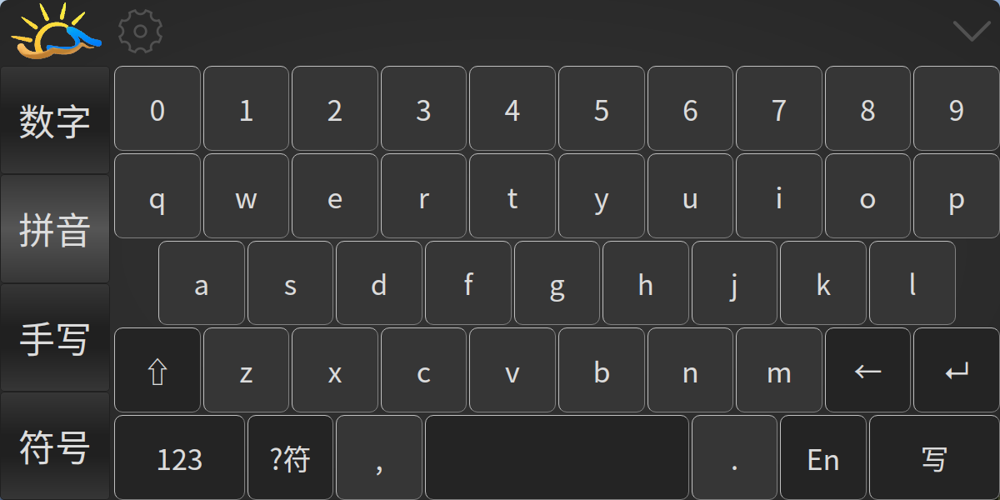

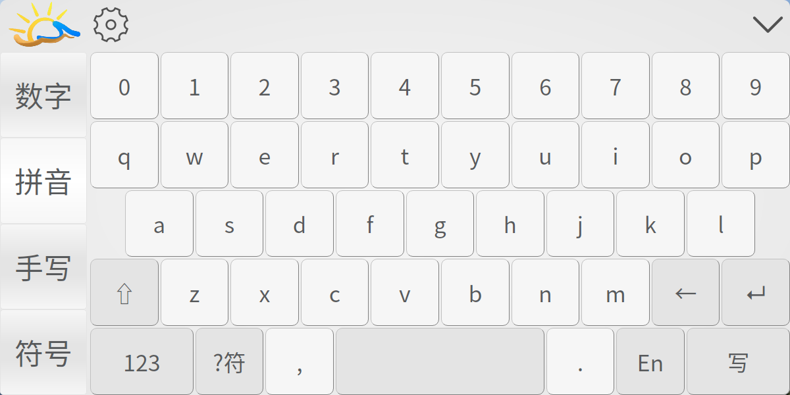

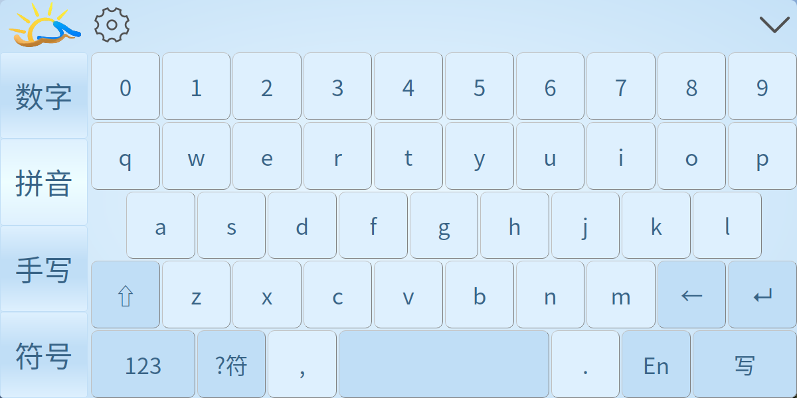

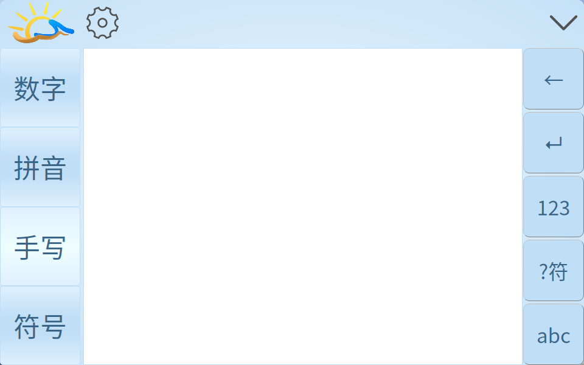

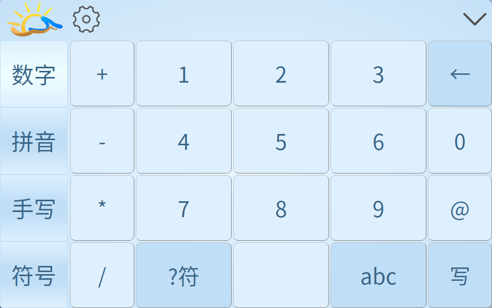

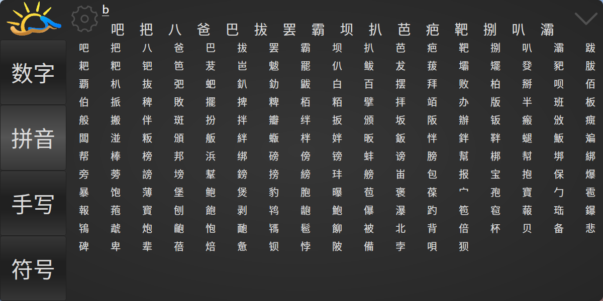

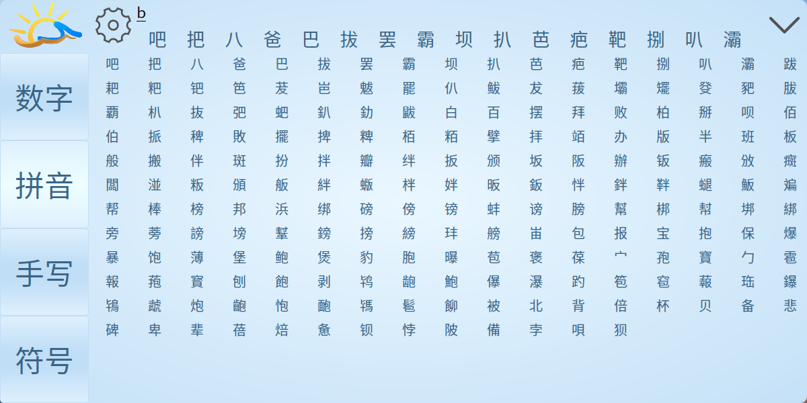

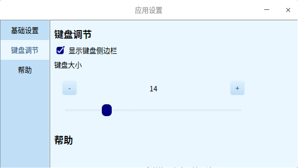

## 手写实例

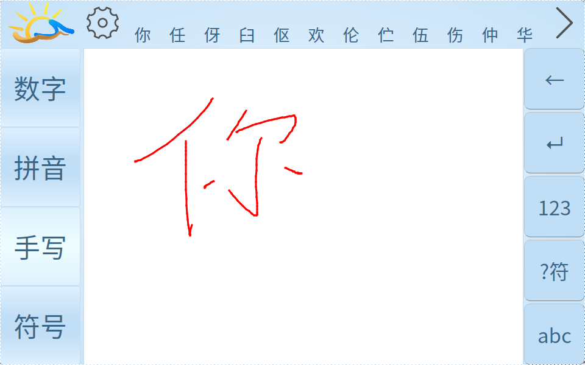

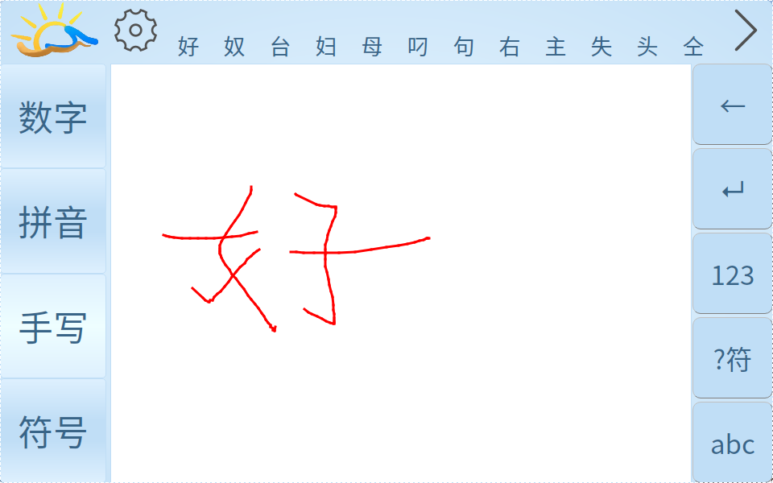
